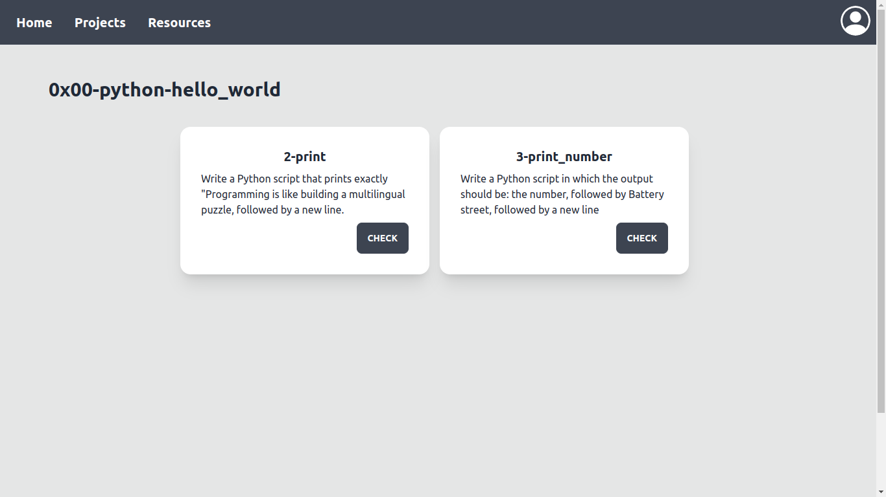

# Mentor - WebStack Portfolio Project

# Overview

Mentor is developed as an online platform inspired by online learning platforms such as HackerRank and ALX's very own intranet.

## Setting up the Project

- Install dependencies

```
$ pip install -r requirements.txt
```

- Create `mentor` table in database

```
$ cat init.sql | mysql -u [USER] -p
Enter password: [PASSWORD]
```

- Run the project

```
$ HOST_USR=[USER] HOST_PWD=[PASSWORD] python3 -m app.routes
```

The SQLAlchemy ORM creates all the neccesary tables during this step.

- Run the setup query to have sample data in the database

```
$ cat setup.sql | mysql -u [USER] -p
Enter password: [PASSWORD]
```

## Screenshots
<div>
    
    
    
    
    
    
    
</div>
